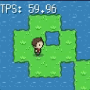

# Adventure Island

Special thanks to @peterhellberg, @hajimehosh, and @Egon for support and guidance

## Day 1

### Part 1 - Draw world

**Estimated (actual):** 5h (4h)

- [x] Draw small 2d world, 10x10 grid
- [x] Single player character in middle
      **Comments**: Initial setup always takes longer than expected. Had to (re)learn both [faiface/pixel](https://github.com/faiface/pixel) and [hajimehoshi/ebiten](https://github.com/hajimehoshi/ebiten). Spent an hour on reading sprites, and another couple of hours on good ways of drawing transitions between `Tile` types. Got lot of help from `#gamedev`.

### Part 2 - Interaction

**Estimated (actual):** 2h (1h)

- [x] Move player character
- [x] Using WASD or arrow keys

**Comments**: Very easy using `ebiten`. Will need to refactor at some point, when game gets more complex. Introduced animation and player direction while I was at it.

### Part 3 - Collision

**Estimated (actual):** 4h (30min)

**Comments**: Only implemented collision with water. Works well.

### Progress - Day 1

Drawing a 2D map, simple player character controlled by WASD or keys, and collision with water.

## Day 2

### Part X - Static resources and hosting on [jsgo.io](jsgo.io)

**Estimated (actual):** 0h (1min)

- [x] Embed sprites `resources/resources.go`
- [x] Host on [jsgo.io](jsgo.io)

**Comments**: Spent about 2-3 hours to learn how to embedd resource images and audio for my [bongo-cat](https://kyeett.github.io/bongo-cat/) application, this in turn is used to deploy a GopherJS version of this game at [jsgo.io](jsgo.io). Used the same techniques for this game. I plan to save one version per day [here](https://kyeett.github.io/adventure-island/), for reference.

#### Part 4 - Collect coins + score

**Estimated (actual):** 3h ()

- [ ] .
- [ ] Touch controls for mobile browser

**Comments**:

## Planned

#### Part 5 - Sync game state over network

<!-- **Estimated (actual):** 8h ()

- [ ] .

**Comments**:  -->

#### Part 6 - Multiplayer **Estimated (actual):** 8h ()

<!-- **Estimated (actual):** 8h ()

- [ ] .

**Comments**:  -->

#### Part 7 - Animation between tiles - **Estimated (actual):** 4h ()

#### Part 8 - Add trees - **Estimated (actual):** 1h ()

#### Part 9 - Character animation **Estimated (actual):** 6h ()

#### Part 10 - Several Z-levels **Estimated (actual):** 6h ()

#### Part 11 - Game chat **Estimated (actual):** 3h ()

#### Part 12 - Compile and publish javascript **Estimated (actual):** 2h ()

### Part 13 - Misc

<!-- **Estimated (actual):** 8h ()
- [ ] Touch relative to player

**Comments**:  -->

### Estimated (actual): 55h (5h30+)

## Resources

- `#gamedev` and `#ebiten` on `https://gophers.slack.com`
- <https://www.mapeditor.org/> - mapeditor for tile games
- [faiface/pixel](https://github.com/faiface/pixel) - 2D game library in Go, used initially
- [hajimehoshi/ebiten](https://github.com/hajimehoshi/ebiten) - Another 2D game library in Go. Can be compiled to javascript using WASM or GopherJS
- [Marching squares](https://en.wikipedia.org/wiki/Marching_squares) - Algorithm for generating contours in 2D maps
- [jsgo.io](jsgo.io) - Site for hosting and caching of GopherJS sites. Used to host this game, [Adventure Island](https://kyeett.github.io/adventure-island/)

## Lessons learnt

[Lessons learnt along the way](LESSONS_LEARNT.md)
